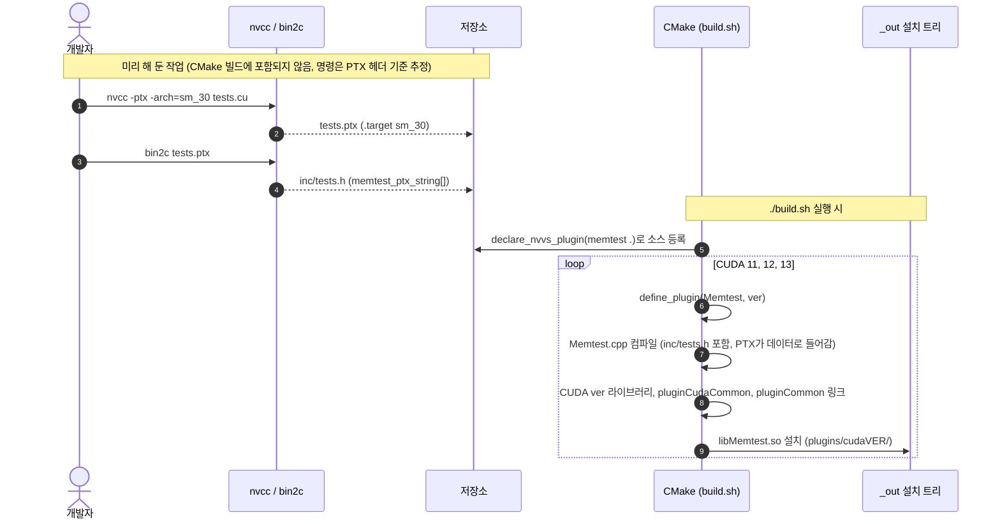
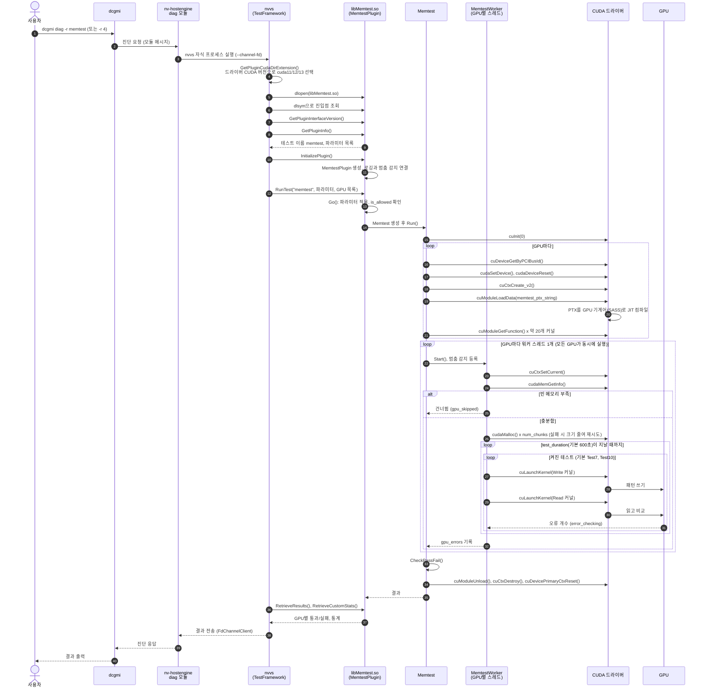
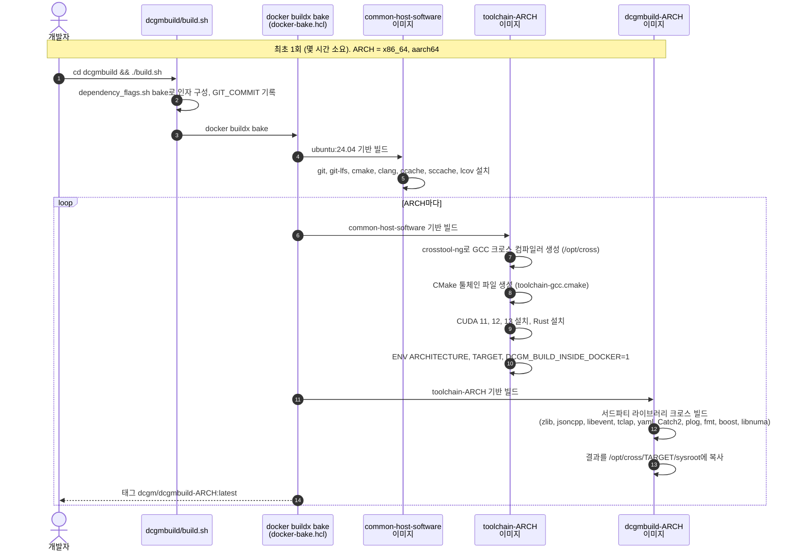
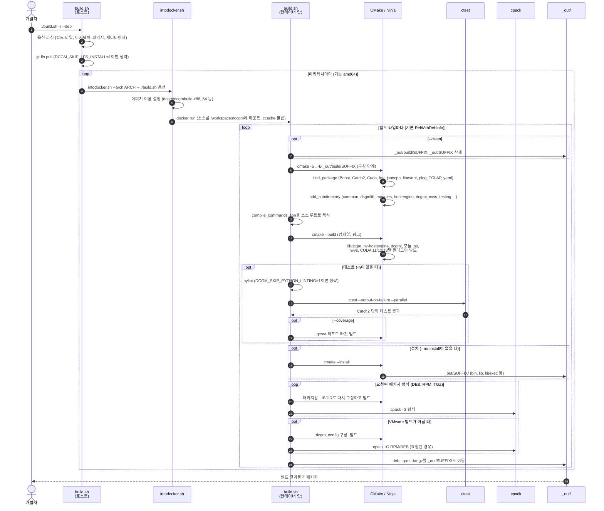

# DCGM 코드 조사

이 저장소의 코드를 읽고 조사한 내용을 주제별로 정리한 문서입니다. GPU가 있는 환경에서 실제로 실행해 확인하지는 않았습니다.

- [1. sm_61(Pascal) GPU 지원](#1-sm_61pascal-gpu-지원)
- [2. nvvs 개요](#2-nvvs-개요)
- [3. memtest 플러그인의 빌드, 로드, 실행 과정](#3-memtest-플러그인의-빌드-로드-실행-과정)
- [4. DCGM 빌드 과정](#4-dcgm-빌드-과정)
- [5. Ubuntu 22.04에서 apt로 설치하고 memtest 실행하기](#5-ubuntu-2204에서-apt로-설치하고-memtest-실행하기)
- [6. memtest 실패 시 오류 주소 확인](#6-memtest-실패-시-오류-주소-확인)
- [7. dcgmi health -c가 하는 검사](#7-dcgmi-health--c가-하는-검사)

## 1. sm_61(Pascal) GPU 지원

이 저장소의 DCGM을 sm_61(Pascal 세대, 예: GTX 1080, Tesla P40·P4) GPU에서 빌드하고 실행할 수 있는지 코드를 기준으로 조사한 결과입니다.

### 요약

- **빌드:** GPU 종류와 상관없이 됩니다.
- **실행:** 모니터링, 헬스, 정책, 설정 기능은 됩니다.
- **진단(NVVS):** 드라이버가 CUDA 13.0 이하를 보고하면 됩니다. L1 캐시 태그 테스트만 건너뜁니다. CUDA 13.1 이상이면 실패할 가능성이 큽니다.
- **프로파일링 지표:** Pascal에서는 쓸 수 없을 가능성이 높습니다(미확인).

### 빌드

빌드는 GPU 종류와 관계없습니다. 빌드는 Docker 이미지 안에서 호스트 코드로만 이루어지고, CMake에 특정 GPU 세대를 지정하는 설정(`CMAKE_CUDA_ARCHITECTURES`, `-gencode` 등)이 없습니다. 진단용 CUDA 커널은 `sm_30` 기준 PTX로 들어가서 실행할 때 드라이버가 컴파일합니다(`nvvs/plugin_src/diagnostic/build_ptx_string.sh`, `nvvs/plugin_src/memory/build_ptx_string.sh`). 빌드 명령은 다른 환경과 같습니다(`./build.sh -r`).

### 실행: 기능별 상황

| 구성 요소 | sm_61 지원 여부 | 근거 |
|---|---|---|
| `nv-hostengine`, `dcgmi`, 필드 모니터링, 헬스, 정책 | 지원. NVML로 동작하며 Pascal을 따로 처리하는 코드가 있음 | `dcgmlib/src/DcgmCacheManager.cpp:1716`, `modules/config/DcgmConfigManager.cpp:251` |
| 진단(NVVS) 대상 GPU 판정 | 지원. Maxwell(5.x) 이상이면 모든 브랜드를 허용 | `nvvs/src/NvidiaValidationSuite.cpp:696-706` |
| 진단의 L1 캐시 태그 테스트 | 미지원. Volta 전용이라 건너뜀 | `nvvs/plugin_src/memory/L1TagCuda.cpp:93-122` |
| `dcgmproftester` | `dcgmproftester12` 사용 필요 | `dcgmproftester/DcgmProfTester.cpp:1213-1225` |
| 프로파일링 지표(`DCGM_FI_PROF_*`) | 코드로 확인할 수 없음. 해당 모듈은 비공개 소스임 | NVIDIA 문서상 Volta 이상만 지원하는 것으로 알고 있음(미확인) |

### 주의: CUDA 13과 Pascal

CUDA 13.0부터 compute capability 7.5 미만 GPU(Maxwell, Pascal, Volta) 지원이 빠졌습니다. 그래서 진단 플러그인은 CUDA 11, 12, 13 버전별로 따로 빌드됩니다(`nvvs/plugin_src/CMakeLists.txt:77`, `SUPPORTED_CUDA_VERSIONS 11 12 13`). 실행할 때 사용할 플러그인 버전은 `nvvs/include/TestFramework.inl:376-407`의 `GetCompatibleCudaMajorVersion()`에서 고릅니다.

```cpp
if ((arch == MAXWELL || arch == PASCAL || arch == VOLTA)
    && cudaDriverMajorVersion == 13 && cudaDriverMinorVersion == 0)
    return 12;   // cuda12 플러그인으로 대체
```

| 드라이버가 보고하는 CUDA 버전 | 선택되는 플러그인 | sm_61에서 결과 |
|---|---|---|
| 11.x | `cuda11` | 정상 |
| 12.x | `cuda12` | 정상 |
| 13.0 | `cuda12`(대체) | 정상 |
| 13.1 이상 | `cuda13` | 진단의 CUDA 테스트가 실패할 가능성이 큼 |

- 대체 조건은 CUDA 버전이 정확히 **13.0**일 때만 적용됩니다.
- `dcgmproftester`도 같은 방식입니다. CUDA 13.0에서는 `dcgmproftester12`를 쓰라는 안내가 나옵니다. 13.1 이상에서는 이런 안내가 없고, 버전이 맞지 않는다는 오류가 납니다.
- Pascal을 지원하는 마지막 드라이버 계열이 R580(CUDA 13.0)인 것으로 알고 있습니다. 그렇다면 Pascal 환경에서 CUDA 13.1 이상이 보고되는 경우는 실제로 없을 수 있습니다. 이 부분은 저장소에서 확인한 내용이 아니므로 NVIDIA 드라이버 지원 정책을 확인해야 합니다.

### 확인되지 않은 사항

- 프로파일링 모듈(`libdcgmmoduleprofiling`)의 Pascal 지원 여부: 비공개 소스라 코드로 확인할 수 없습니다.
- Pascal을 지원하는 마지막 드라이버 계열과 그 드라이버가 보고하는 CUDA 버전: NVIDIA 공식 자료로 확인해야 합니다.
- 실제 sm_61 GPU에서의 동작: 위 내용은 모두 코드를 읽고 판단한 것입니다.

## 2. nvvs 개요

nvvs(**NVIDIA Validation Suite**)는 DCGM에 들어 있는 **GPU 진단 프로그램**입니다. GPU에 실제로 부하를 주어 하드웨어에 문제가 없는지 검사합니다. `dcgmi diag`를 실행하면 실제 검사는 이 `nvvs` 바이너리가 수행합니다.

### 위치와 역할

```
dcgmi diag -r 3
   └─▶ nv-hostengine (diag 모듈: modules/diag/DcgmDiagManager.cpp)
          └─▶ nvvs 자식 프로세스 실행 (nvvs/src/NvvsMain.cpp)
                 ├─ 소프트웨어 검사: 드라이버, 권한, 환경 변수 등 (GPU 부하 없음)
                 └─ 플러그인 로드(dlopen): memtest, pcie, targeted_power ...
                        └─ GPU에서 CUDA 커널 실행
          ◀── 결과를 파이프(--channel-fd)로 반환 (FdChannelClient)
```

- **왜 별도 프로세스인가:** 진단은 GPU에 강한 부하를 주고 CUDA 컨텍스트를 만듭니다. 이 작업을 모니터링 데몬(`nv-hostengine`) 밖에서 실행하면, 진단이 멈추거나 실패해도 데몬은 영향을 받지 않습니다. diag 모듈은 nvvs를 `ChildProcess`로 실행하고, 필요하면 SIGTERM이나 SIGKILL로 중단합니다.
- **nvvs가 하는 일:**
  - 테스트 대상 GPU를 고릅니다. Maxwell 이상이거나 허용 목록에 있는 GPU만 대상입니다.
  - 설정 파일(`nvvs/nvvs.conf`)과 GPU 모델(SKU)별 기본 파라미터(`nvvs/diag-skus.yaml.in`)를 읽습니다.
  - 알맞은 CUDA 버전의 플러그인 디렉터리를 골라 플러그인을 로드하고 실행합니다.
  - 결과를 모아 diag 모듈에 돌려줍니다.

### 진단 단계별 테스트

`dcgmi diag -r <단계>`의 단계 번호(1~4)는 diag 모듈이 nvvs에 넘기는 테스트 묶음 이름(short/medium/long/xlong)으로 바뀝니다(`modules/diag/DcgmDiagManager.cpp:374-387`, 값은 `dcgmlib/dcgm_structs.h:1965-1968`의 `DCGM_POLICY_VALID_SV_*`). 각 묶음에 들어가는 테스트는 `nvvs/src/NvidiaValidationSuite.cpp:1128-1190`에서 정합니다. 단계가 높을수록 아래 단계의 테스트를 모두 포함합니다.

| 단계 | 묶음 이름 | 추가되는 테스트 |
|---|---|---|
| 1 | short(quick) | 소프트웨어 검사(denylist, NVML/CUDA 라이브러리, 권한, persistence mode, 페이지 리타이어먼트, Inforom, Fabric Manager 등) |
| 2 | medium | memory, pcie |
| 3 | long | diagnostic(gpuburn), nvbandwidth, nccl_tests, memory_bandwidth, targeted_stress, targeted_power (root이면 EUD도) |
| 4 | xlong | memtest, pulse_test |

### 소스 구성

| 경로 | 내용 |
|---|---|
| `nvvs/src/` | nvvs 본체: 진입점 `NvvsMain.cpp`, 명령행 처리와 GPU 선택(`NvidiaValidationSuite.cpp`), 플러그인 로드(`PluginLib.cpp`) |
| `nvvs/include/TestFramework.inl` | 플러그인 디렉터리(cuda11/12/13) 선택과 테스트 실행 흐름 |
| `nvvs/plugin_src/` | 테스트 플러그인들. 각각 `libXxx.so`로 빌드되고 CUDA 버전별로 따로 만들어짐 |
| `nvvs/nvvs.conf`, `nvvs/diag-skus.yaml.in` | 기본 설정과 GPU 모델별 파라미터 |

### 참고

- nvvs는 단독으로도 실행할 수 있습니다. 예를 들어 `-g`/`--listGpus`로 GPU 목록을 보고, `-c`로 설정 파일을, `-p`로 플러그인 경로를 지정할 수 있습니다. 보통은 `dcgmi diag`를 통해 간접적으로 실행합니다.
- 플러그인 하나가 어떻게 빌드, 로드, 실행되는지는 [3장](#3-memtest-플러그인의-빌드-로드-실행-과정)의 memtest 예시에 정리했습니다.

## 3. memtest 플러그인의 빌드, 로드, 실행 과정

memtest는 CUDA 커널을 미리 PTX 텍스트로 만들어 플러그인 `.so` 안에 바이트 배열로 넣어 둡니다. 진단을 실행하면 `nvvs`가 이 `.so`를 `dlopen`으로 열고, 플러그인이 그 PTX를 CUDA Driver API로 GPU에 올려 커널을 실행합니다.

```
[미리 해 둔 작업] tests.cu ──nvcc -ptx──▶ tests.ptx ──bin2c──▶ inc/tests.h (memtest_ptx_string[])
[빌드]            Memtest.cpp + inc/tests.h ──CUDA 11/12/13별로──▶ plugins/cudaXX/libMemtest.so.*
[실행]            dcgmi diag ─▶ nv-hostengine(diag 모듈) ─▶ nvvs 자식 프로세스 ─dlopen─▶ libMemtest
                  ─▶ cuModuleLoadData(PTX) ─(드라이버가 JIT 컴파일)─▶ cuLaunchKernel
```

### 시퀀스 다이어그램

**빌드 단계** (이미지: [memtest_sequence_build.png](memtest_sequence_build.png))



**로드와 실행 단계** (이미지: [memtest_sequence_run.png](memtest_sequence_run.png))



### 빌드 단계

**① 커널 소스 → PTX → C 헤더 (저장소에 이미 들어 있음)**
- GPU 커널은 `nvvs/plugin_src/memtest/tests.cu`에 있습니다. `move_inv_write`, `test0_*`부터 `test10_*`까지 모두 `extern "C" __global__`로 선언되어 있습니다.
- 이 파일을 컴파일한 결과인 `tests.ptx`가 저장소에 들어 있습니다. PTX 헤더를 보면 CUDA 10.2 컴파일러로 `.target sm_30`, `.version 6.5`로 생성되었습니다.
- PTX는 `bin2c`로 변환되어 `inc/tests.h`의 `unsigned char memtest_ptx_string[]` 배열이 됩니다([bin2c 설명](#bin2c란)).
- 이 과정은 CMake 빌드에 포함되어 있지 않습니다. 커널을 바꾸면 PTX와 헤더를 직접 다시 만들어야 합니다. 옆에 있는 memory 플러그인은 이 작업용 스크립트(`nvvs/plugin_src/memory/build_ptx_string.sh`: nvcc `-ptx -arch=sm_30` 후 `bin2c`)가 있지만, memtest 폴더에는 이런 스크립트가 없습니다.

**② 플러그인 공유 라이브러리 빌드**
- `memtest/CMakeLists.txt`는 `declare_nvvs_plugin(memtest .)`으로 소스를 등록합니다. 그다음 `Cuda11/`, `Cuda12/`, `Cuda13/` 하위 디렉터리마다 `define_plugin(Memtest <ver>)`를 호출합니다.
- `define_plugin` 매크로(`nvvs/plugin_src/CMakeLists.txt:44-75`)가 같은 소스를 CUDA 버전마다 한 번씩 빌드해 `Memtest_11`, `Memtest_12`, `Memtest_13` 타깃을 만듭니다.
  - 해당 버전의 CUDA 라이브러리와 `pluginCudaCommon_<ver>`, `pluginCommon`을 링크합니다.
  - 출력 이름은 `Memtest`입니다.
  - 외부에 공개할 심볼은 `nvvs_plugin.linux_def` 버전 스크립트로 제한합니다.
- `Memtest.cpp`는 `#include <inc/tests.h>`로 PTX 배열을 가져오므로, PTX가 `.so` 안에 데이터로 들어갑니다.
- 설치 경로는 `libexec/datacenter-gpu-manager-4/plugins/cuda{11,12,13}/`입니다(`CMakeLists.txt:703-720`).

### bin2c란

`bin2c`는 **CUDA Toolkit에 들어 있는 작은 명령행 도구**로, 파일 내용을 **C 소스의 바이트 배열**로 바꿔 줍니다. 이 저장소에서는 PTX 파일을 C 헤더로 바꿔 플러그인 `.so` 안에 넣는 데 씁니다.

```
입력: tests.ptx (텍스트 파일)            출력: inc/tests.h (C 헤더)
//                                      unsigned char memtest_ptx_string[] = {
// Generated by NVIDIA NVVM Compiler    0x2f,0x2f,0x0a,0x2f,0x2f,0x20,0x47,0x65,...
...                                     ...,0x00
                                        };
```

- 파일의 각 바이트를 `0x..` 형식으로 나열한 배열을 만듭니다. 위 예에서 `0x2f,0x2f,0x0a`는 PTX 첫 줄의 `//`와 줄바꿈입니다.
- 이 헤더를 `#include`하면 파일 내용이 컴파일된 바이너리 안에 데이터로 들어갑니다. 실행할 때 파일을 따로 찾아 읽을 필요가 없습니다.

**저장소에서 쓰는 방식.** memory 플러그인의 스크립트(`nvvs/plugin_src/memory/build_ptx_string.sh`)에 사용법이 나와 있습니다.

```bash
nvcc -ptx -m64 -arch=sm_30 -o l1tag.ptx l1tag.cu                         # ① CUDA 커널 → PTX
bin2c l1tag.ptx --padd 0 --name l1tag_ptx_string > l1tag_ptx_string.h    # ② PTX → C 배열
python find_ptx_symbols.py l1tag.ptx l1tag_ptx_string.h                  # ③ 커널 이름 상수 추가
```

| 옵션 | 의미 |
|---|---|
| `--name l1tag_ptx_string` | 생성할 배열의 이름 |
| `--padd 0` | 배열 끝에 `0x00` 바이트를 붙임 |

memtest의 `inc/tests.h`도 같은 방식으로 만들어진 것으로 보입니다. 파일 내용이 그와 맞습니다.

- `tests.ptx`는 91,776바이트이고, `memtest_ptx_string[]`은 **91,777바이트**입니다. 마지막 1바이트가 `--padd 0`으로 붙은 `0x00`입니다.
- 배열 뒤에는 `const char *move_inv_write_func_name = "move_inv_write";` 같은 커널 이름 상수가 붙어 있습니다. 이는 ③의 `find_ptx_symbols.py` 같은 스크립트가 추가하는 형태입니다. `Memtest.cpp`는 이 이름으로 `cuModuleGetFunction`을 호출합니다.

**왜 끝에 0x00을 붙이나.** `cuModuleLoadData(&module, memtest_ptx_string)`에 넘기는 PTX는 **NUL(`\0`)로 끝나는 문자열**이어야 합니다. 이 함수는 길이를 따로 받지 않고, 드라이버가 문자열의 끝을 보고 PTX의 끝을 판단하기 때문입니다.

**주의.** 이 과정은 CMake 빌드에 포함되어 있지 않습니다. `tests.cu`를 고치면 nvcc → bin2c → 커널 이름 추가 과정을 직접 다시 실행해 `inc/tests.h`를 새로 만들어야 합니다. 역할은 `xxd -i`와 비슷하며, `bin2c`는 CUDA Toolkit의 `bin/` 디렉터리에 들어 있습니다. 이 조사 환경에는 CUDA Toolkit이 없어 `bin2c`를 직접 실행해 보지는 못했고, 저장소의 스크립트와 생성된 파일을 보고 확인했습니다.

### 실행 경로: 진단 요청부터 플러그인 로드까지

1. **요청:** memtest는 `dcgmi diag -r memtest`처럼 이름으로 지정하거나, 가장 긴 진단 단계(`NVVS_SUITE_XLONG`, 레벨 4)에 포함되어 실행됩니다(`nvvs/src/NvidiaValidationSuite.cpp:1170-1174`).
2. **nvvs 실행:** `nv-hostengine`의 diag 모듈(`modules/diag/DcgmDiagManager.cpp`)이 `nvvs` 바이너리를 자식 프로세스로 실행합니다.
3. **플러그인 디렉터리 선택:** nvvs는 드라이버가 보고하는 CUDA 버전을 보고 `/cuda11/`, `/cuda12/`, `/cuda13/` 중 하나를 고릅니다(`GetPluginCudaDirExtension`, `nvvs/include/TestFramework.inl:325`). [1장](#주의-cuda-13과-pascal)의 Pascal/CUDA 13.0 대체 규칙이 여기서 적용됩니다.
4. **dlopen:** nvvs는 선택한 디렉터리에서 `*.so.<숫자>` 파일을 모두 찾아 `dlopen`합니다(`LoadPluginWithDir`, `nvvs/src/PluginLib.cpp:180`). 그다음 `dlsym`으로 필수 진입점을 찾습니다.

   | 진입점(`MemtestWrapper.cpp`) | 역할 |
   |---|---|
   | `GetPluginInterfaceVersion` | 플러그인 인터페이스 버전 확인 |
   | `GetPluginInfo` | 테스트 이름 `memtest`와 파라미터 목록(`test_duration`, `test0`~`test10`, `num_chunks` 등) 등록 |
   | `InitializePlugin` | `MemtestPlugin` 객체 생성, 로깅과 멈춤 감지(hang detection) 연결 |
   | `RunTest` | `MemtestPlugin::Go()` 호출 |
   | `RetrieveResults` / `RetrieveCustomStats` | 결과와 통계를 nvvs에 반환 |

5. **Go():** `memtest_wrapper.cpp:55`에서 파라미터를 적용합니다(기본 `test_duration` 600초). `is_allowed`가 false이면 테스트를 건너뜁니다. 그 외에는 `Memtest` 객체를 만들어 `Run()`을 호출합니다.

### GPU에 로드하기 (`Memtest.cpp`)

`Memtest::Run()`(`Memtest.cpp:535`)은 다음 순서로 진행합니다.

1. **Init():** `cuInit(0)`을 호출합니다. 그다음 DCGM이 넘겨준 GPU마다 PCI 버스 ID로 `cuDeviceGetByPCIBusId`를 호출해 CUDA 장치를 찾습니다. PCI ID로 찾기 때문에 `CUDA_VISIBLE_DEVICES`로 순서가 바뀌어도 맞는 GPU를 찾습니다.
2. **CudaInit():** GPU마다 `cudaSetDevice`, `cudaDeviceReset`으로 상태를 정리한 뒤 `cuCtxCreate_v2`로 전용 컨텍스트를 만듭니다.
3. **LoadCudaModule():** 핵심 단계입니다(`Memtest.cpp:260`).
   - `cuModuleLoadData(&gpu->cuModule, memtest_ptx_string)`로 `.so`에 들어 있는 PTX 텍스트를 드라이버에 넘깁니다.
   - 이때 **드라이버가 PTX를 해당 GPU의 기계어(SASS)로 JIT 컴파일**합니다. PTX가 `sm_30` 기준이라 sm_61을 포함한 이후 세대 GPU에서도 드라이버가 컴파일할 수 있습니다.
   - 그다음 `cuModuleGetFunction`으로 커널 함수 핸들(`cuFuncTest0Write`, `cuFuncMoveInvRead` 등 약 20개)을 하나씩 가져옵니다.

### 커널 실행

1. **워커 스레드:** GPU마다 `MemtestWorker` 스레드를 하나씩 띄우고 멈춤 감지에 등록합니다(`Memtest.cpp:560-575`). 모든 워커가 끝날 때까지 기다립니다.
2. **메모리 확보:** `MemtestWorker::run()`(`Memtest.cpp:802`)이 다음을 수행합니다.
   - `cuCtxSetCurrent`로 자기 GPU의 컨텍스트를 현재 스레드에 연결합니다.
   - `cudaMemGetInfo`로 빈 메모리를 확인합니다. 빈 메모리가 `minimum_allocation_percentage`보다 적으면 테스트를 건너뜁니다.
   - `MemoryChunkManager`가 1MB(`BLOCKSIZE`) 단위로 계산한 크기를 `num_chunks`개 청크로 나누어 할당합니다. 기본은 `cudaMalloc`이고, `use_mapped_mem`이 켜져 있으면 `cudaHostAlloc(Mapped)`를 씁니다.
   - 할당에 실패하면 크기를 조금씩 줄이며 다시 시도합니다.
3. **테스트 반복:** `RunTests()`(`Memtest.cpp:727`)는 `cuda_memtests[]` 표에서 켜진 테스트만 차례로 실행합니다. 기본으로 켜진 것은 Test7(랜덤 숫자 시퀀스)과 Test10(메모리 스트레스)입니다. 이 순서를 `test_duration`이 지날 때까지 반복합니다.
4. **커널 호출:** 각 `testN()` 함수는 청크별로 `cuLaunchKernel(gpu->cuFuncTestNWrite, grid…)`를 실행해 패턴을 씁니다. 그다음 Read 커널로 다시 읽어 비교합니다. 오류 개수는 `error_checking()`으로 모읍니다.
5. **판정과 정리:** `CheckPassFail()`이 GPU별 오류 개수(`gpu_errors[]`)로 통과/실패를 정합니다. `Cleanup()`은 `cuModuleUnload`, `cuCtxDestroy`, `cuDevicePrimaryCtxReset`으로 자원을 해제합니다. 결과는 `RetrieveResults`를 통해 nvvs로, 다시 diag 모듈과 `dcgmi`로 전달됩니다.

### 참고

- 커널은 CUDA Runtime의 `<<<>>>` 문법이 아니라 **Driver API(`cuModuleLoadData` + `cuLaunchKernel`)** 로 실행됩니다. 그래서 `.so`에는 fatbin이 없고 PTX 텍스트만 들어 있습니다. 커널 기계어는 실행할 때마다 설치된 드라이버가 만듭니다.
- 테스트할 때 `__DCGM_DIAG_MEMTEST_FAIL_GPU` 환경 변수를 설정하면 가짜 실패를 만들 수 있습니다(`Memtest.cpp:719`). 가짜 GPU(NVML 인젝션) 환경에서는 커널을 실행하지 않고 통과로 처리합니다(`memtest_wrapper.cpp`의 `UsingFakeGpus`).

## 4. DCGM 빌드 과정

DCGM 빌드는 두 단계로 나뉩니다. 먼저 **빌드 이미지**(컴파일러, CUDA, 서드파티 라이브러리가 들어 있는 Docker 이미지)를 한 번 만들고, 그다음 **`./build.sh`**가 그 이미지 안에서 CMake로 DCGM을 빌드합니다.

### 빌드 이미지 만들기 (최초 1회)

이미지: [dcgm_build_sequence_image.png](dcgm_build_sequence_image.png)



- `dcgmbuild/build.sh`는 `docker buildx bake`로 `dcgmbuild/docker-bake.hcl`의 세 타깃을 차례로 빌드합니다. 아키텍처(x86_64, aarch64)마다 따로 만듭니다.

  | 이미지 | 기반 | 내용 | 근거 |
  |---|---|---|---|
  | `common-host-software` | `ubuntu:24.04` | git, git-lfs, cmake, clang, ripgrep, lcov, ccache, sccache | `dcgmbuild/container-images/common-host-software/scripts/` |
  | `toolchain-ARCH` | common-host-software | crosstool-ng로 만든 GCC 크로스 컴파일러(`/opt/cross`), CMake 툴체인 파일, CUDA, Rust | `dcgmbuild/container-images/toolchain/Dockerfile` |
  | `dcgmbuild-ARCH` | toolchain-ARCH | 크로스 빌드한 서드파티 라이브러리를 sysroot(`/opt/cross/TARGET/sysroot`)에 설치 | `dcgmbuild/container-images/dcgmbuild/scripts/` |

- toolchain 이미지는 `ARCHITECTURE`, `TARGET`, `CMAKE_TOOLCHAIN_FILE`, `DCGM_BUILD_INSIDE_DOCKER=1` 환경 변수를 설정합니다. `build.sh`는 이 값으로 자신이 컨테이너 안에서 실행 중인지 판단합니다.
- 결과 태그는 `dcgm/dcgmbuild-x86_64:latest`, `dcgm/dcgmbuild-aarch64:latest`입니다. `intodocker.sh`는 `DCGM_DOCKER_IMAGE`(기본 `dcgm/dcgmbuild`) 뒤에 `-아키텍처`를 붙여 이 이미지를 찾습니다.

### DCGM 빌드하기 (`./build.sh`)

이미지: [dcgm_build_sequence_build.png](dcgm_build_sequence_build.png)



- **호스트에서:** `build.sh`는 옵션을 해석하고 `git lfs pull`을 한 뒤, 아키텍처마다 `intodocker.sh`로 **자기 자신을 컨테이너 안에서 다시 실행**합니다. `intodocker.sh`는 소스 디렉터리를 `/workspaces/<프로젝트명>`에 마운트하고, ccache를 쓰면 `_out/compiler-cache`를 캐시 디렉터리로 연결합니다.
- **컨테이너 안에서:** 빌드 타입(Debug, RelWithDebInfo)마다 다음을 실행합니다. `SUFFIX`는 `Linux-amd64-relwithdebinfo` 같은 형태입니다.
  1. `cmake -S . -B _out/build/SUFFIX`로 구성합니다. Ninja가 있으면 Ninja를 씁니다. `BUILD_TESTING`은 `-n` 옵션에 따라 정해집니다.
  2. `compile_commands.json`을 소스 루트로 복사합니다(IDE와 clang 도구용).
  3. `cmake --build`로 전체를 빌드합니다. 병렬 수는 `NPROC`(기본 `nproc`)입니다.
  4. 테스트를 켠 경우 pylint와 `ctest`를 실행하고, `--coverage`이면 gcovr 리포트를 만듭니다.
  5. `cmake --install`로 `_out/SUFFIX/`에 설치합니다.
  6. 요청한 패키지 형식(DEB, RPM, TGZ)마다 `CMAKE_INSTALL_LIBDIR`를 바꿔 다시 구성하고 빌드한 뒤 `cpack`으로 패키지를 만듭니다. VMware 빌드가 아니면 `dcgm_config` 패키지도 만듭니다.
  7. 만든 `.deb`, `.rpm`, `.tar.gz`를 `_out/SUFFIX/`로 옮깁니다.
- 근거: `build.sh:116-343`(옵션 파싱 116-198, 컨테이너 진입 207-222, 빌드 루프 261-343), `intodocker.sh`, `dcgmbuild/build.sh`, `dcgmbuild/docker-bake.hcl`.
- toolchain 이미지에는 Rust와 Corrosion이 설치되고 `cmake/Rust.cmake`도 있지만, 현재 어떤 `CMakeLists.txt`도 이를 불러 쓰지 않아 다이어그램에서는 뺐습니다.

## 5. Ubuntu 22.04에서 apt로 설치하고 memtest 실행하기

패키지 이름, 서비스 이름, `dcgmi diag` 옵션, memtest 파라미터와 기본값은 저장소 코드에서 확인했습니다. **apt 저장소 주소와 등록 절차는 NVIDIA 공식 설치 방법을 기억에 의존해 옮긴 것**이고 실행해 보지는 않았습니다. 실제로 설치하기 전에 [NVIDIA DCGM 문서](https://docs.nvidia.com/datacenter/dcgm/latest/)의 설치 절차와 대조하세요.

### 사전 조건

- NVIDIA 데이터센터 드라이버가 설치되어 있고 `nvidia-smi`가 동작해야 합니다.
- 드라이버가 지원하는 CUDA 메이저 버전을 확인합니다.
  ```bash
  nvidia-smi | grep "CUDA Version"
  ```

### apt로 설치

```bash
# ① NVIDIA CUDA 저장소 등록 (Ubuntu 22.04 = ubuntu2204)
wget https://developer.download.nvidia.com/compute/cuda/repos/ubuntu2204/x86_64/cuda-keyring_1.1-1_all.deb
sudo dpkg -i cuda-keyring_1.1-1_all.deb
sudo apt-get update

# ② 예전 DCGM 3.x가 있으면 제거 (4.x 패키지와 충돌)
sudo apt-get purge -y datacenter-gpu-manager

# ③ 드라이버의 CUDA 메이저 버전에 맞춰 설치
CUDA_MAJOR=$(nvidia-smi | sed -E -n 's/.*CUDA Version: ([0-9]+)[.].*/\1/p')
sudo apt-get install -y --install-recommends datacenter-gpu-manager-4-cuda${CUDA_MAJOR}

# ④ 호스트 엔진 서비스 시작
sudo systemctl --now enable nvidia-dcgm
```

**패키지 구성** (`cmake/packaging.cmake:131-140` 기준, 기본 이름은 `datacenter-gpu-manager-4`)

| 패키지 | 내용 |
|---|---|
| `datacenter-gpu-manager-4-core` | `nv-hostengine`, `dcgmi`, 라이브러리, 모듈 |
| `datacenter-gpu-manager-4-cuda11` / `-cuda12` / `-cuda13` | 해당 CUDA 버전용 nvvs 플러그인(**memtest 포함**) |
| `datacenter-gpu-manager-4-cuda-all` | 위 세 CUDA 패키지를 모두 설치 |
| `datacenter-gpu-manager-4-dev` | 헤더 등 개발용 파일 |

- memtest는 `cudaXX` 패키지 안에 있습니다(`/usr/libexec/datacenter-gpu-manager-4/plugins/cudaXX/`). `core` 패키지만 설치하면 memtest를 실행할 수 없습니다.
- **Pascal(sm_61) 같은 구형 GPU에서 드라이버가 CUDA 13.0을 보고하는 경우**, nvvs는 cuda12 플러그인을 사용합니다([1장](#주의-cuda-13과-pascal) 참고). 이때는 `-cuda13`이 아니라 `-cuda12`를 설치하거나, 간단히 `-cuda-all`을 설치하세요.
- 서비스 이름 `nvidia-dcgm`과 실행 명령 `nv-hostengine -n --service-account nvidia-dcgm`은 `config-files/systemd/nvidia-dcgm.service.in`에서 확인했습니다.

**설치 확인**

```bash
systemctl status nvidia-dcgm     # active (running) 인지 확인
dcgmi discovery -l               # GPU 목록이 보이면 정상
```

### memtest 실행

memtest는 GPU 메모리에 패턴을 쓰고 다시 읽어 오류를 찾습니다. **기본으로 600초(10분) 동안 실행**되고, 실행 중에는 GPU 메모리를 대부분 차지합니다. 내부 동작은 [3장](#3-memtest-플러그인의-빌드-로드-실행-과정)을 참고하세요.

```bash
# 기본 실행: 모든 GPU, 600초
sudo dcgmi diag -r memtest

# 짧게 시험: 60초
sudo dcgmi diag -r memtest -p "memtest.test_duration=60"

# 특정 GPU만 (GPU 0과 1)
sudo dcgmi diag -r memtest -i 0,1 -p "memtest.test_duration=60"

# 결과를 JSON으로 출력
sudo dcgmi diag -r memtest -p "memtest.test_duration=60" -j

# 가장 긴 진단 단계(4, xlong)에 포함해 실행 (다른 테스트도 함께 실행되어 오래 걸림)
sudo dcgmi diag -r 4
```

**주요 옵션** (`dcgmi/CommandLineParser.cpp`)

| 옵션 | 의미 |
|---|---|
| `-r memtest` | 실행할 테스트 이름 또는 단계 번호(1~4) |
| `-p "테스트.파라미터=값;..."` | 테스트 파라미터. 여러 개는 `;`로 구분 |
| `-i 0,1` | 진단할 엔티티(GPU) 목록 (`--entity-id`) |
| `-j` | JSON 출력 |
| `--iterations N` | N번 연속 실행 |

**memtest 파라미터와 기본값** (`nvvs/plugin_src/memtest/memtest_wrapper.cpp:33-50`, `nvvs/plugin_src/include/PluginCommon.h:25`)

| 파라미터 | 기본값 | 의미 |
|---|---|---|
| `test_duration` | 600 | 실행 시간(초) |
| `test0`~`test10` | test7, test10만 `True` | 개별 테스트 켜기/끄기. 예: `memtest.test2=true` |
| `num_chunks` | 1 | 메모리를 몇 조각으로 나눠 할당할지 |
| `use_mapped_mem` | False | GPU 메모리 대신 호스트 매핑 메모리 사용 |
| `minimum_allocation_percentage` | 75 | 빈 메모리가 전체의 이 비율(%)보다 적으면 테스트를 **건너뜀** |

예를 들어 모든 테스트를 켜고 5분 동안 실행하려면 이렇게 합니다.

```bash
sudo dcgmi diag -r memtest -p "memtest.test_duration=300;memtest.test0=true;memtest.test1=true;memtest.test2=true;memtest.test3=true;memtest.test4=true;memtest.test5=true;memtest.test6=true;memtest.test8=true;memtest.test9=true"
```

### 결과 보기와 문제 해결

- 결과는 GPU마다 `Pass` / `Fail` / `Skip`으로 표시됩니다.
- **Skip이 나올 때:** 빈 GPU 메모리가 75% 미만인 경우가 가장 흔합니다. `nvidia-smi`로 GPU를 쓰는 프로세스를 확인하고 종료한 뒤 다시 실행하세요.
- **자세한 로그:** README에 나온 대로 디버그 로그를 남길 수 있습니다.
  ```bash
  sudo dcgmi diag -r memtest -p "memtest.test_duration=60" --debugLogFile /tmp/diag.log -d ERROR
  ```
- **호스트 엔진에 연결되지 않을 때:** `sudo systemctl restart nvidia-dcgm`을 실행하고, `journalctl -u nvidia-dcgm`으로 로그를 확인하세요.

## 6. memtest 실패 시 오류 주소 확인

**결론:** 알 수 있지만 제한이 있습니다. memtest는 실패한 주소를 기록하지만, 그 주소는 `dcgmi diag` 결과 화면에는 나오지 않고 **nvvs 디버그 로그에만** 남습니다. 또 그 값은 **GPU 가상 주소**라서 물리 DRAM 위치와 바로 대응하지 않습니다.

### 주소가 기록되는 과정

1. **GPU 커널에서 기록:** 각 Read/Check 커널은 기대값과 다른 값을 발견하면 `RECORD_ERR` 매크로로 다음을 기록합니다(`nvvs/plugin_src/memtest/tests.cu:48-55`).
   ```c
   idx = atomicAdd(err, 1) % MAX_ERR_RECORD_COUNT;   // MAX_ERR_RECORD_COUNT = 10 (misc.h:46)
   err_addr[idx]        = (unsigned long)p;          // 오류 주소
   err_expect[idx]      = expect;                    // 기대값
   err_current[idx]     = current;                   // 처음 읽은 값
   err_second_read[idx] = *p;                        // 다시 읽은 값
   ```
2. **호스트에서 로그로 출력:** 테스트마다 `error_checking()`(`Memtest.cpp:928-990`)이 이 배열을 GPU에서 복사해 와 **ERROR 레벨 로그**로 남깁니다.
   ```
   N errors found in block <블록 번호>
   the last K error addresses are: <주소> <주소> ...
   :0th error, expected value=..., current value=...
   (second_read=..., expect=...
   ```
3. **최종 결과에는 개수만 남음:** `CheckPassFailSkipSingleGpu()`(`Memtest.cpp:633-655`)는 오류 **개수**만으로 판정합니다. 사용자에게 보이는 결과에는 `Device N recorded M errors during memtest`와 `DCGM_FR_MEMORY_MISMATCH` 오류만 표시되고, **주소는 들어가지 않습니다.**

### 주소를 보는 방법

```bash
sudo dcgmi diag -r memtest -p "memtest.test_duration=60" \
     --debugLogFile /tmp/memtest.log -d ERROR
grep -A20 "errors found in block" /tmp/memtest.log
```

- `-d`(`--debugLevel`)를 ERROR 이상으로 지정해야 합니다. 주소 로그가 `DCGM_LOG_ERROR`로 출력되기 때문입니다.
- 로그 파일은 절대 경로로 지정하는 것이 안전합니다. 경로를 생략하면 기본 파일 이름은 `nvvs.log`인데(`common/DcgmLogging.h:56`), 이 파일이 어느 디렉터리에 생기는지는 코드로 확인하지 못했습니다.
- 플러그인 로그는 호스트 엔진 로깅 콜백으로도 전달되도록 연결되어 있습니다(`InitializePlugin`). 그래서 `nv-hostengine` 로그에도 남을 수 있지만, 이것도 확인하지 못했습니다.

### 주의할 점

| 제한 | 이유 |
|---|---|
| **가상 주소임** | `err_addr`는 `cudaMalloc`으로 받은 포인터 값, 즉 GPU 가상 주소입니다. 물리 DRAM 주소, 뱅크, 행(row) 위치가 아닙니다. 실행할 때마다 값이 달라질 수 있습니다. |
| **최대 10개만 남음** | 기록 버퍼가 10칸이고 `% 10`으로 덮어씁니다. 오류가 많으면 앞의 기록은 사라지고, 로그 문구대로 "마지막 10개"만 남습니다. |
| **"블록 번호"의 의미가 테스트마다 다름** | 대부분 1MB 블록 인덱스(청크 번호 × 청크당 블록 수 + i)입니다. 하지만 test0 전역 주소 검사처럼 청크 번호를 넘기는 곳도 있습니다(`Memtest.cpp:1065`). |
| **주소를 볼 수 있는 곳이 로그뿐** | JSON 출력(`-j`)이나 `dcgmi` 결과 화면에는 주소가 없습니다. |

참고로 `error_checking()`은 오류 배열을 초기화할 때 `err_second_read`는 지우지 않습니다(`Memtest.cpp:978-985`). 다음 기록 때 덮어써지므로 결과에는 사실상 영향이 없습니다.

### 물리 위치가 필요하다면

하드웨어 수준의 메모리 오류 위치는 memtest가 아니라 **드라이버의 ECC와 행 재매핑(row remapping) 기록**으로 확인하는 것이 정확합니다.

```bash
nvidia-smi -q -d ECC,ROW_REMAPPER,PAGE_RETIREMENT   # 오류 개수, 재매핑된 행, 퇴역 페이지
dcgmi health -s m && sleep 60 && dcgmi health -c    # DCGM 헬스 검사 (메모리 감시를 켠 뒤 판정, 7장 참고)
```

DCGM도 이 정보를 필드로 제공합니다. 예를 들어 행 재매핑 관련 `DCGM_FI_DEV_*ROW_REMAP*` 필드와 ECC 오류 카운터가 있습니다. 진단 1단계(short)의 소프트웨어 검사 "Page Retirement/Row Remap"([2장](#진단-단계별-테스트))도 이 정보를 봅니다.

이 장은 코드를 읽고 정리한 내용이며, 실제 GPU에서 실패를 재현해 보지는 않았습니다.

## 7. `dcgmi health -c`가 하는 검사

**핵심:** `dcgmi health -c`는 GPU에 부하를 주는 **테스트를 실행하지 않습니다.** 먼저 `dcgmi health -s`로 켜 둔 **감시 항목(watch)** 에 대해, DCGM이 백그라운드에서 모아 둔 필드 값과 XID 이벤트를 **기준값과 비교해 판정만** 합니다(수동적 검사). 부하를 주는 능동적 검사는 `dcgmi diag`(nvvs, [2장](#2-nvvs-개요))가 담당합니다.

### 사용 순서

```bash
dcgmi health -s a      # ① 감시 항목 켜기 (a = 전체, 기본값은 pm = PCIe+메모리)
# (*) 표시 항목은 첫 조회 전에 60초 이상 데이터가 쌓여야 함
dcgmi health -c        # ② 쌓인 데이터로 판정
dcgmi health -f        # 현재 켜진 감시 항목 확인
dcgmi health --clear   # 감시 끄기
```

- 감시 항목을 켜지 않고 `-c`를 실행하면 `Health watches not enabled` 오류가 납니다(`dcgmi/Health.cpp:375-386`).
- `-s` 옵션 문자: `a` 전체, `d` 드라이버, `i` InfoROM, `m` 메모리(*), `n` NVLink(*), `p` PCIe(*), `t` 온도·전력(*), `x` ConnectX(*) (`dcgmi/CommandLineParser.cpp:1236-1249`)
- `-u`(기본 30초)는 드라이버에서 값을 가져오는 주기이고, `-m`(기본 600초)은 샘플을 보관하는 시간입니다.
- 결과는 항목별로 `Healthy` / `Warning` / `Failure`로 표시됩니다.

### 검사 항목 (GPU 기준)

판정 로직은 `modules/health/DcgmHealthWatch.cpp`의 `MonitorWatchesForGpu()`(538행)에서 항목별 `Monitor*()` 함수로 나뉩니다.

| 감시 항목 | 보는 데이터 | 판정 기준 |
|---|---|---|
| **항상 검사** (감시 항목과 무관) | 치명적 XID | XID 48(DBE), 74(NVLink 치명), 79(버스 이탈), 95, 119·120(GSP), 140(ECC 복구 불가) → **Failure**. XID 94(격리된 오류) → **Warning** |
| **PCIe** (`p`) | `DCGM_FI_DEV_PCIE_REPLAY_TOTAL` | 1분 동안의 replay 증가량이 PCIe 세대·레인 수로 정한 기대치를 넘으면 **Warning**. XID 38, 39, 42도 Warning |
| **메모리** (`m`) | ECC, 페이지 퇴역, 행 재매핑 필드 | 아래 표 참고. XID 31, 32, 43, 63은 Warning, XID 64는 Failure |
| **InfoROM** (`i`) | `DCGM_FI_DEV_INFOROM_VALID` | InfoROM이 손상되었으면 **Warning** |
| **온도** (`t`) | `DCGM_FI_DEV_THERMAL_VIOLATION` | 기간 중 온도 때문에 클럭이 제한된 시간이 있으면 **Warning**. XID 60, 61, 62도 Warning |
| **전력** (`t`) | `DCGM_FI_DEV_POWER_VIOLATION`, `DCGM_FI_DEV_BOARD_POWER_WATTS` | 전력 때문에 클럭이 제한되었거나 전력을 읽을 수 없으면 **Warning**. XID 54, 56, 57, 58, 78도 Warning |
| **NVLink** (`n`) | 링크 상태, CRC·replay·recovery 오류 카운터, Fabric Manager 상태 | 링크 다운 → **Failure**. 오류 카운터 증가 → Warning 또는 Failure. XID 67, 73, 121은 Warning |
| **드라이버** (`d`) | `DCGM_FI_DEV_GPU_RECOVERY_ACTION` | 드라이버가 리셋, 재부팅, 작업 정리(drain)를 권고하면 **Warning/Failure** |

**메모리 세부 검사** (`MonitorMem()`, 2193행에서 차례로 호출)

| 검사 | 필드 | 판정 |
|---|---|---|
| 휘발성 DBE | `DCGM_FI_DEV_ECC_DBE_VOL_TOTAL` | 기간 중 Double Bit ECC 오류 발생 → **Failure** |
| 퇴역 대기 페이지 | `DCGM_FI_DEV_PAGE_RETIRED_PENDING` | 퇴역 대기 중인 페이지가 있으면 → **Warning** (재부팅이나 리셋 필요) |
| 퇴역 페이지 수 | `DCGM_FI_DEV_PAGE_RETIRED_SBE/DBE_TOTAL` | SBE와 DBE 합계가 63 이상이면 → **Failure**. DBE가 15개를 넘은 뒤 1주일 동안 계속 늘어나면 → **Failure** (`common/DcgmGPUHardwareLimits.h:21-22`) |
| 행 재매핑 실패 | `DCGM_FI_DEV_ROW_REMAP_FAILED` | 실패가 있으면 → **Failure** |
| 수정 불가 행 재매핑 | `DCGM_FI_DEV_ROW_REMAP_UNCORRECTABLE_TOTAL` | 512 이상이면 → **Warning** (`DcgmGPUHardwareLimits.h:39`) |
| 복구 불가 메모리 | `DCGM_FI_DEV_MEMORY_UNREPAIRABLE` | 복구 불가 표시가 있으면 → **Failure** |

### 그 밖의 참고 사항

- **GPU에서는 판정하지 않는 항목:** enum에는 SM, PMU, MCU 항목도 있지만 GPU 판정 코드의 `switch`에서는 `default`로 무시됩니다(`DcgmHealthWatch.cpp:606`의 "ignore everything else for now").
- **GPU가 아닌 장치:** NVSwitch(치명·비치명 오류), ConnectX, CPU(`MonitorCpuThermal`, `MonitorCpuPower`)는 각각 별도 판정 함수가 있습니다.
- **`diag`와의 차이:** `health -c`는 즉시 끝나고 GPU를 점유하지 않아 운영 중에도 주기적으로 실행할 수 있습니다. 대신 이미 드라이버에 기록된 증상만 볼 수 있습니다. 숨어 있는 메모리 결함을 찾으려면 memtest 같은 `diag`가 필요합니다.

이 장도 코드를 읽고 정리한 내용이며, 실제 GPU에서 실행해 확인하지는 않았습니다.

## 참고
- GPU 1,000장 모니터링 하기: NVIDIA DCGM 활용 전략, https://tech.ktcloud.com/entry/GPU-1000장-모니터링-하기-NVIDIA-DCGM-활용-전략
